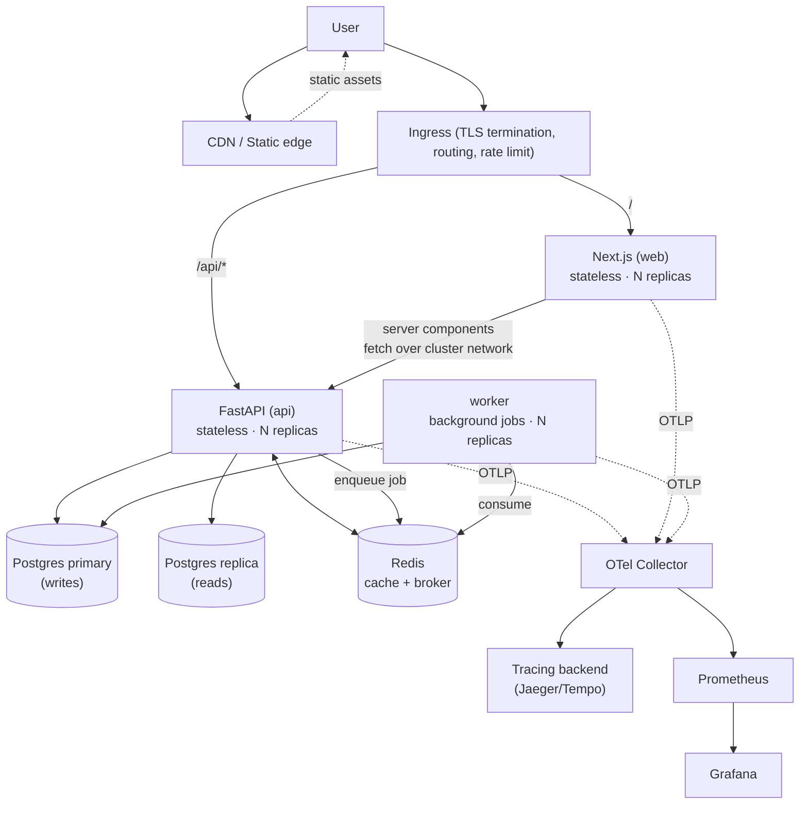
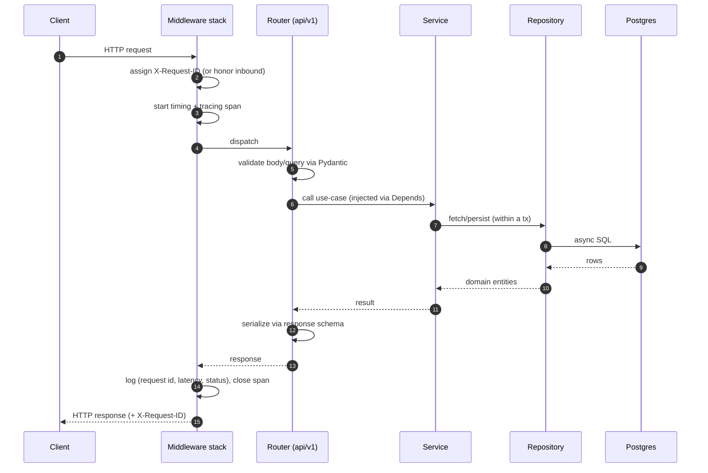
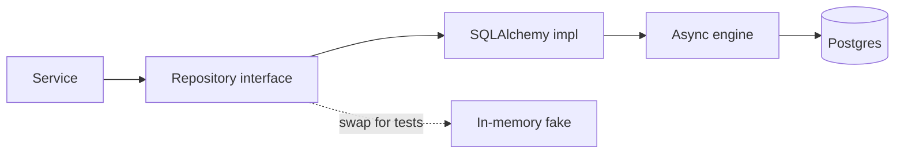
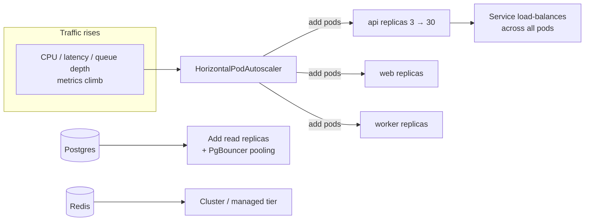

# Architecture

This document explains *how* the skeleton is put together and *why*. If the
README is the sales pitch, this is the engineering rationale. Read it once
before you start changing things — the conventions here are what keep the
codebase scalable as it grows.

- [Design principles](#design-principles)
- [System topology](#system-topology)
- [Backend: layered architecture](#backend-layered-architecture)
- [Request lifecycle](#request-lifecycle)
- [Data & persistence](#data--persistence)
- [Caching & background work](#caching--background-work)
- [Configuration & secrets](#configuration--secrets)
- [Observability](#observability)
- [Security model](#security-model)
- [How it scales](#how-it-scales)
- [Failure handling](#failure-handling)
- [Frontend architecture](#frontend-architecture)
- [Extending the system](#extending-the-system)

---

## Design principles

1. **Boring on purpose.** Every choice favours the well-trodden path. Novelty
   is reserved for *your* product, not the plumbing.
2. **Stateless compute, stateful edges.** Application processes hold no durable
   state. All state lives in Postgres/Redis. This is the single most important
   property for horizontal scaling.
3. **Dependencies point inward.** Transport depends on services, services on
   repositories, repositories on the domain. The domain depends on nothing.
   You can read any layer without understanding the one above it.
4. **The contract is explicit.** Pydantic schemas and the generated OpenAPI
   spec are the source of truth between frontend and backend.
5. **Twelve-factor.** Config from the environment, logs to stdout, processes
   are disposable, dev/prod parity via Docker.
6. **Make the right thing the easy thing.** Adding a feature the correct way is
   the path of least resistance because the seams already exist.

---

## System topology

Three stateless compute tiers (`web`, `api`, `worker`), two stateful backing
services (`postgres`, `redis`), and an observability sidecar path. Everything in
the compute tier is replaceable and horizontally scalable; everything stateful
is managed deliberately.

---

## Backend: layered architecture

The backend is a layered / hexagonal design. Each layer has one job and may only
call the layer directly beneath it.

| Layer | Directory | Responsibility | May import |
|-------|-----------|----------------|-----------|
| **Transport** | `app/api/` | HTTP routing, request/response, auth deps, status codes | services, schemas |
| **Service** | `app/services/` | Use-cases, orchestration, business rules, transactions | repositories, domain |
| **Repository** | `app/repositories/` | Data access; hides SQL/Redis behind an interface | domain, db |
| **Domain** | `app/domain/` | Pure entities and value objects, no framework | nothing |
| **Schema** | `app/schemas/` | Pydantic DTOs — the wire contract | domain (for mapping) |
| **Core** | `app/core/` | Config, logging, security primitives, lifespan | nothing app-specific |

**The dependency rule:** an arrow may only point downward. A router must never
touch the database directly; a repository must never import FastAPI. If you find
yourself wanting to break this, that's a signal the responsibility belongs in a
different layer.

Why bother? Because this is what lets the codebase grow to hundreds of files
without becoming a hairball. New engineers can reason locally. Tests can target a
single layer. You can swap Postgres for something else by rewriting one
directory. The example `items` feature demonstrates the full stack across all
layers so you always have a reference implementation in front of you.

---

## Request lifecycle

Every request gets a **request ID** that flows through logs and traces, so a
single user-reported error can be traced across services in one query. Errors
raised anywhere are caught by the error-handling middleware and rendered as
**RFC 9457 `application/problem+json`** so clients get a consistent, typed error
shape.

---

## Data & persistence

- **SQLAlchemy 2.0 async** with the `asyncpg` driver. One async engine, a
  per-request session provided by a FastAPI dependency, committed/rolled back at
  the request boundary.
- **Alembic** owns the schema. No `create_all()` in production — every change is
  a reviewed, versioned migration (`make migration m="..."`).
- **Repository pattern.** Services speak to repository interfaces, not the ORM.
  A generic `BaseRepository[Entity]` provides `get`, `list`, `create`, `update`,
  `delete`; concrete repos add query methods. This keeps SQL in one place and
  makes services trivially unit-testable with a fake repo.
- **Read/write split ready.** The engine factory accepts a separate read DSN;
  point reads at a replica when you need to. Nothing in the service layer changes.

---

## Caching & background work

- **Cache:** a small `Cache` protocol backed by Redis (`get`/`set`/`delete` with
  TTL). Use it for read-through caching of expensive queries. Because it's an
  interface, tests use an in-memory implementation.
- **Background jobs:** the `app/workers/` skeleton shows a producer (the API
  enqueues a job onto Redis) and a consumer (a separate `worker` process drains
  the queue). This is intentionally minimal — swap in Celery, Arq, Dramatiq, or
  a managed queue as your needs grow, keeping the same enqueue/handle seam.
- **Why a separate worker tier?** Long or bursty work must not block request
  threads or share the API's scaling signal. The worker scales on queue depth;
  the API scales on request latency/CPU.

---

## Configuration & secrets

All configuration comes from the environment via a single typed
`Settings` object (Pydantic Settings). Nothing reads `os.environ` directly.

- **Local:** `.env` (gitignored), seeded from `.env.example`.
- **Cluster:** non-secret config via `ConfigMap`, secrets via `Secret` (and in
  real life, an external secret store / sealed-secrets — see the security guide).
- **Validation at boot:** if a required variable is missing or malformed, the
  process fails fast on startup rather than misbehaving at runtime.

The frontend mirrors this with a typed env module so a missing `NEXT_PUBLIC_*`
var is a build-time error, not a blank screen in production.

---

## Observability

The three pillars are wired and correlated:

- **Logs** — structured JSON in production (human-friendly in dev), every line
  tagged with the request ID, via `structlog`.
- **Traces** — OpenTelemetry auto-instrumentation for FastAPI, SQLAlchemy, and
  Redis. Spans export over OTLP to any collector. Disabled cleanly if no
  endpoint is configured.
- **Metrics** — a Prometheus `/metrics` endpoint exposes request rate, latency
  histograms, and error counts (the RED method). Dashboards scrape it.

Health endpoints distinguish *liveness* (`/healthz` — is the process up?) from
*readiness* (`/readyz` — can it serve, i.e. is the DB reachable?). Kubernetes
uses them to avoid routing traffic to a pod that isn't ready.

---

## Security model

Defense in depth, with the hooks in place even though there's no auth logic to
protect yet:

- **Transport:** TLS terminates at the ingress; HSTS and security headers set at
  the edge and in Next.js config.
- **AuthN/AuthZ:** a JWT verification dependency and a `CurrentUser` seam are
  stubbed in `app/core/security.py` and `app/api/v1/deps.py`. Wire them to your
  IdP (Auth0/Clerk/Cognito/your own) — the injection point already exists.
- **Input:** every request body and query is validated by Pydantic before it
  reaches your code.
- **Rate limiting:** a Redis-backed limiter dependency guards expensive routes.
- **Least privilege:** containers run as a non-root user, read-only root
  filesystem where possible, dropped Linux capabilities; NetworkPolicies
  restrict pod-to-pod traffic to what's needed.
- **Secrets** never live in images or git. See `docs/guides/security.md`.

---

## How it scales

The scaling story, tier by tier:

- **Stateless tiers (web/api/worker):** scale horizontally. The HPA adds pods
  when CPU or a custom metric (request latency, queue depth) crosses a target.
  Because no pod holds state, any pod can serve any request.
- **Database:** the usual ladder — connection pooling (PgBouncer), then read
  replicas for read-heavy load, then partitioning/sharding or a managed
  distributed Postgres if you ever truly outgrow a single primary. The
  repository layer means these changes don't ripple into business code.
- **Cache:** Redis absorbs read load and hot keys; promote to a managed/clustered
  tier under pressure.
- **Stateless = cheap elasticity.** This is why the statelessness rule is
  non-negotiable: it's the property that makes everything above it possible.

Full playbook: [`docs/guides/scaling.md`](./docs/guides/scaling.md).

---

## Failure handling

- **Graceful shutdown:** on `SIGTERM`, the app stops accepting new requests,
  drains in-flight ones, and closes DB/Redis pools before exiting — so rolling
  deploys don't drop requests.
- **Probes:** readiness gating prevents traffic to pods that can't reach their
  dependencies; liveness restarts wedged pods.
- **Timeouts & retries:** outbound calls carry timeouts; the HTTP client in the
  frontend retries idempotent requests with backoff.
- **Pod Disruption Budgets** keep a minimum number of replicas during node
  drains and upgrades.
- **Idempotency seam:** mutating endpoints can honor an `Idempotency-Key`
  (sketched in the example) so client retries don't double-apply.

---

## Frontend architecture

- **Next.js App Router** with React Server Components by default; client
  components only where interactivity demands it.
- **Typed env** (`lib/env.ts`) validated at build time — secrets stay server-side,
  only `NEXT_PUBLIC_*` reach the browser.
- **One typed API client** (`lib/api-client.ts`) wraps `fetch` with base URL,
  timeouts, error normalization, and request-ID propagation. Server components
  call the API over the internal cluster URL; the browser uses the public URL.
- **Layered UI:** route segments compose presentational components; data fetching
  lives in server components or route handlers, not buried in leaf components.

---

## Extending the system

The repository is a skeleton, so "extending" is the main activity. The golden
rules:

1. Put logic in the **service** layer. Routers stay thin; repositories stay dumb.
2. Cross a layer boundary only through its interface.
3. Every schema change gets a migration.
4. Every new env var goes in `.env.example`, `config.py`, and the relevant
   ConfigMap/Secret.
5. If you're copying more than a few lines between features, lift it into a
   shared helper or a base class.

Start from the `items` example, rename, and delete what you don't need. The
shape of the codebase will hold as you scale from one feature to a hundred.
