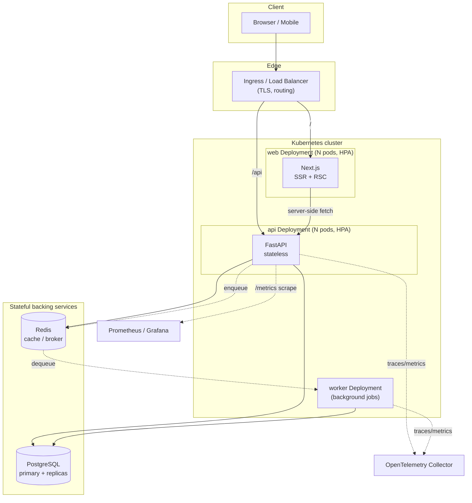
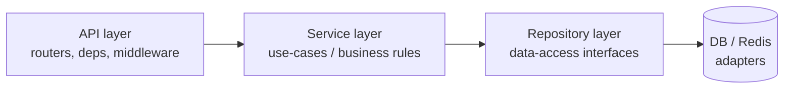

<div align="center">

# Scalable Starter

**A production-grade, platform-agnostic full-stack skeleton.**
Next.js + FastAPI · built to scale on Kubernetes · **zero business logic**.

Fork it, delete the example feature, and ship _your_ product on day one
instead of spending the first month wiring config, logging, auth scaffolding,
migrations, containers, CI, and Kubernetes manifests.

[](https://github.com/chriswu727/scalable-starter/actions/workflows/ci.yml)
[](https://github.com/chriswu727/scalable-starter/actions/workflows/codeql.yml)
[](./LICENSE)
[](./CONTRIBUTING.md)

[Quickstart](#quickstart-2-commands) ·
[Architecture](#architecture) ·
[Add a feature](#add-a-feature-in-5-minutes) ·
[Deploy](#deploy) ·
[ARCHITECTURE.md](./ARCHITECTURE.md) · [docs/](./docs)


</div>

---

## Why this exists

Every new product starts with the same three weeks of undifferentiated plumbing.
This repo is that plumbing, done once and done well, so you never write it again.

It is deliberately **empty of features**. There is exactly one trivial example
endpoint (`/api/v1/items`) wired end-to-end — frontend to API to service to
repository to database — purely to show you the seams. Delete it and the
skeleton still stands.

What you get instead of features:

- **A real architecture, not a single file that grows into a swamp.** Clear
  layers (transport, service, repository, data) with dependency rules that
  keep a 200-file codebase as navigable as a 20-file one.
- **Horizontal scalability baked in.** Stateless services, externalized
  session/cache, health/readiness probes, graceful shutdown, and a Kubernetes
  HPA so the answer to "we got traffic" is "it already scaled."
- **Platform-agnostic.** Run it with `docker compose up` on a laptop, or
  `kubectl apply -k` on any conformant cluster (EKS, GKE, AKS, k3s, kind). No
  managed-service lock-in is assumed.
- **Opinionated defaults, swappable parts.** Postgres + Redis today; the
  repository and cache interfaces mean you can swap them without touching
  business code.
- **The boring, critical stuff is finished:** typed config, structured logging
  with request-ID correlation, RFC-9457 error responses, CORS, rate-limit hook,
  OpenTelemetry tracing, Prometheus metrics, migrations, tests, multi-stage
  non-root Docker images, and CI that runs the same checks you run locally.

If you are a startup or a "vibe coder," the goal is simple: **`git clone`,
`make up`, start building the thing that actually makes you different.**

---

## What's in the box

| Layer           | Choice                                           | Why                                                        |
| --------------- | ------------------------------------------------ | ---------------------------------------------------------- |
| Frontend        | **Next.js 16 (App Router) + React 19 + TS**      | SSR/RSC, huge ecosystem, the default for fast product work |
| Backend         | **FastAPI + Python 3.13**                        | Async, type-driven, auto OpenAPI, gentle learning curve    |
| Validation/DTOs | **Pydantic v2**                                  | Fast, strict, the FastAPI-native contract layer            |
| Data access     | **SQLAlchemy 2.0 (async) + Alembic**             | Mature ORM + first-class migrations                        |
| Database        | **PostgreSQL**                                   | The dependable default for 99% of products                 |
| Cache / broker  | **Redis**                                        | Cache, rate-limit store, lightweight queue                 |
| Monorepo        | **pnpm workspaces + Turborepo**                  | One repo, fast cached builds, shared types                 |
| Containers      | **Multi-stage Docker (non-root)**                | Small, reproducible, secure images                         |
| Orchestration   | **Kubernetes + Kustomize**                       | Cloud-agnostic, base + per-env overlays, HPA autoscaling   |
| Observability   | **OpenTelemetry + Prometheus + structured logs** | Traces, metrics, logs correlated by request ID             |
| CI/CD           | **GitHub Actions**                               | Lint, typecheck, test, build, image — mirrors `make check` |

See [`ARCHITECTURE.md`](./ARCHITECTURE.md) for the full design rationale and
[`docs/adr/`](./docs/adr) for the decision records behind each choice.

---

## Architecture



The backend follows a **layered (ports-and-adapters) architecture**. Dependencies
point inward only — transport knows about services, services know about
repositories, nothing in the core knows about HTTP or SQL specifics:



Full request lifecycle, scaling model, and failure handling live in
[`ARCHITECTURE.md`](./ARCHITECTURE.md).

---

## Repo layout

```
scalable-starter/
├── apps/
│   ├── web/                  # Next.js frontend (App Router, TS strict)
│   │   ├── app/              # routes, layouts, route handlers
│   │   ├── components/       # presentational components
│   │   └── lib/              # api-client, typed env, utils
│   └── api/                  # FastAPI backend (layered)
│       └── app/
│           ├── core/         # config, logging, security, lifespan
│           ├── api/v1/       # routers + dependencies (transport)
│           ├── services/     # use-cases (business rules)  <-- your logic
│           ├── repositories/ # data-access interfaces + impls
│           ├── schemas/      # Pydantic DTOs (the API contract)
│           ├── db/           # async engine, session, models
│           ├── middleware/   # request-id, timing, error handling
│           ├── observability/# tracing + metrics
│           └── workers/      # background job consumer skeleton
├── packages/                 # shared TS packages (tsconfig, eslint, api-contract)
├── infra/
│   ├── docker/               # multi-stage Dockerfiles
│   └── k8s/                  # kustomize: base/ + overlays/{dev,staging,prod}
├── docs/                     # architecture, guides, ADRs, diagrams
├── .github/workflows/        # CI/CD
├── docker-compose.yml        # local dev stack
├── Makefile                  # every command you need (`make help`)
└── ARCHITECTURE.md           # the system design, in depth
```

---

## Quickstart (2 commands)

**Option A — Docker (recommended, nothing to install but Docker):**

```bash
cp .env.example .env
make up           # builds & starts web + api + postgres + redis
```

- Web: http://localhost:3000
- API docs (Swagger): http://localhost:8000/docs
- Health: http://localhost:8000/healthz

**Option B — Local dev (hot reload, requires Node 20+ and Python 3.12+):**

```bash
make setup        # installs JS + Python deps, creates .env
make migrate      # apply database migrations
make dev          # runs web and api in watch mode
```

Run `make help` to see every available command.

---

## Add a feature in 5 minutes

The skeleton's whole point is that adding a feature is mechanical. To add a
`projects` resource you touch one file per layer — the example `items`
feature is your copy-paste template:

1. **Model** — `app/db/models/project.py`, exported from `models/__init__.py` so
   Alembic sees it.
2. **Schema** — `app/schemas/project.py`: Pydantic `ProjectCreate` / `ProjectRead`.
3. **Repository** — `app/repositories/project.py`: subclass the generic async repo.
4. **Service** — `app/services/project.py`: your business rules.
5. **Router** — `app/api/v1/routes/projects.py`: thin HTTP layer, calls the service.
6. Register the router in `app/api/v1/router.py`, run `make migration m="add projects"`,
   and you're done.

The frontend mirrors this: add a typed client call in `lib/api-client.ts` and a
route under `app/`. See [`docs/guides/adding-a-feature.md`](./docs/guides/adding-a-feature.md).

---

## Deploy

**Anywhere Docker runs** — build the images directly:

```bash
docker build -f infra/docker/api.Dockerfile -t myreg/app-api:tag .
docker build -f infra/docker/web.Dockerfile -t myreg/app-web:tag .
```

**Kubernetes** (any conformant cluster — EKS, GKE, AKS, k3s, kind):

```bash
kubectl kustomize infra/k8s/overlays/prod   # inspect what will be applied
kubectl apply -k infra/k8s/overlays/prod    # apply it
```

Each overlay (`dev` / `staging` / `prod`) patches replica counts, resource
limits, image tags, and env without duplicating the base manifests. Autoscaling
(HPA), pod-disruption budgets, network policies, and liveness/readiness probes
are part of the base. See [`docs/guides/deployment.md`](./docs/guides/deployment.md)
and [`docs/guides/scaling.md`](./docs/guides/scaling.md).

---

## Swap the defaults

Nothing here is load-bearing if you don't want it to be:

- **Different database?** Implement the repository interface against your store;
  services never see SQL.
- **Different frontend (mobile, another SPA)?** The API is a clean, documented
  OpenAPI surface — point any client at it.
- **Different Python framework or even language?** The layered boundaries and the
  `infra/` + `docs/` scaffolding transfer; only `apps/api/app` changes.
- **Serverless instead of K8s?** The stateless API and typed config port cleanly;
  drop `infra/k8s` and add your platform's adapter.

---

## License

[MIT](./LICENSE) — do whatever you want. Attribution appreciated, not required.
